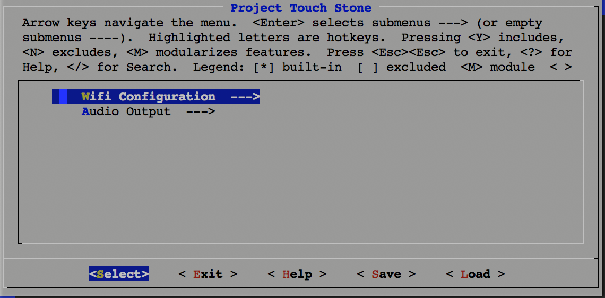
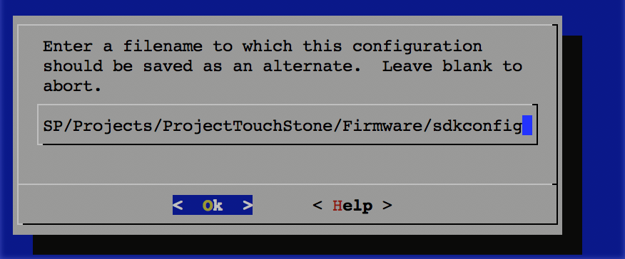

# Project TouchStone (firmware)
Firmware is based on : - 
  1. https://github.com/MrBuddyCasino/ESP32_MP3_Decoder
  2. https://github.com/espressif/ESP8266_MP3_DECODER

firmware was written by:

1.Shoaib Omar. 
2.Shan Sam Gao.

## How to set up & compile 

1. Edit the config file using `make menuconfig` in the Firmware Folder

2. Set the Wifi Credentials by going to (Project Touch Stone -> Wifi Configuration)

  </img> 
  </img> 
  </img> 
  </img> 
  </img> 
  </img> 
  </img> 

3. Then to compile run `make` (if you want to flash it on to the device `make flash`)
4. To open the Serial Monitor it's `make monitor`
5. If you have issues with the serial port, open the menuconfig and go to (Serial flasher config -> Default serial port) and edit the value there

## Circuit Diagram

